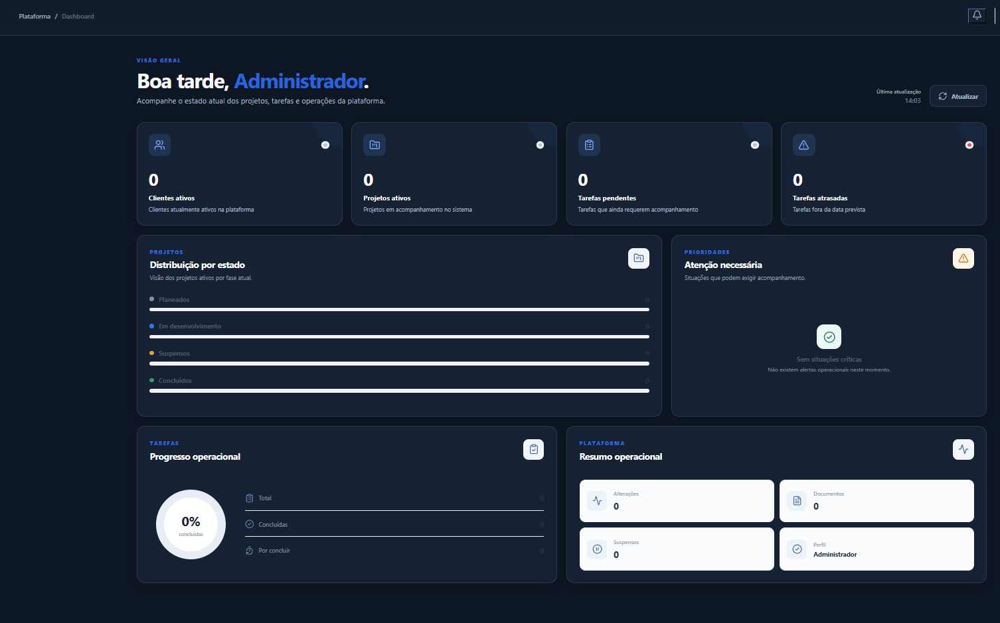
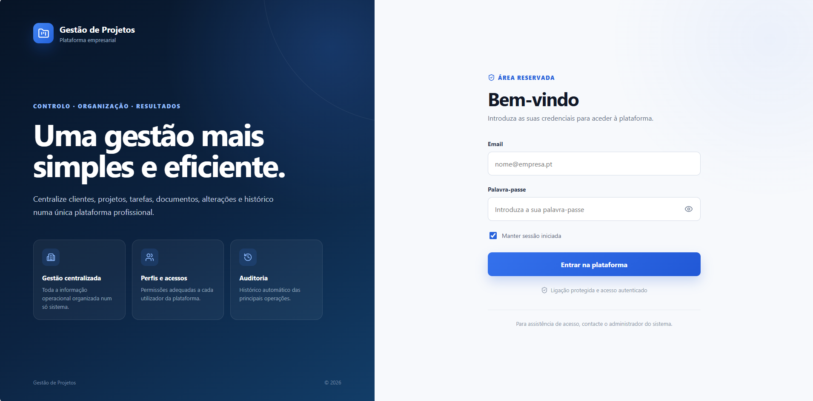
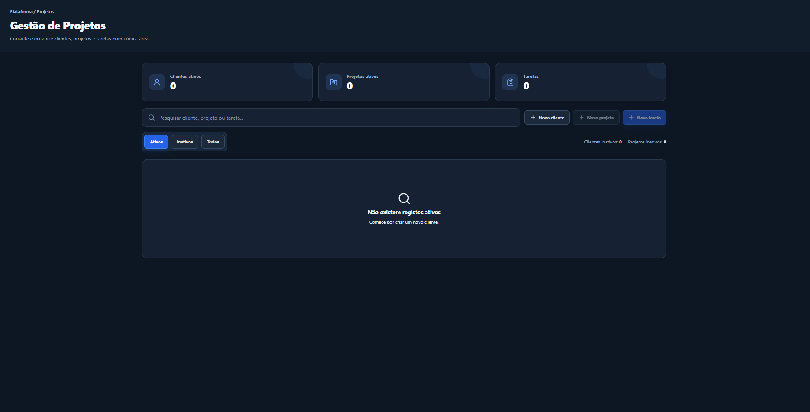
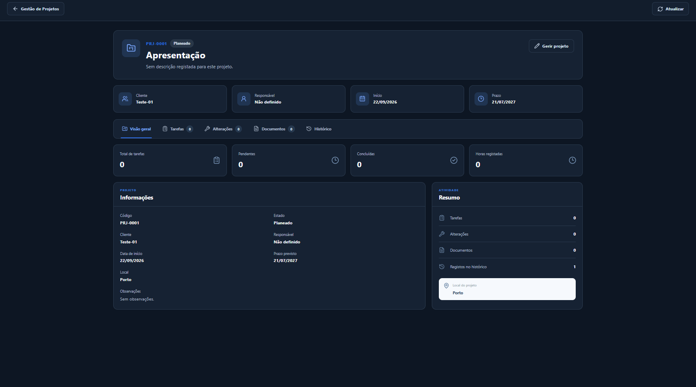
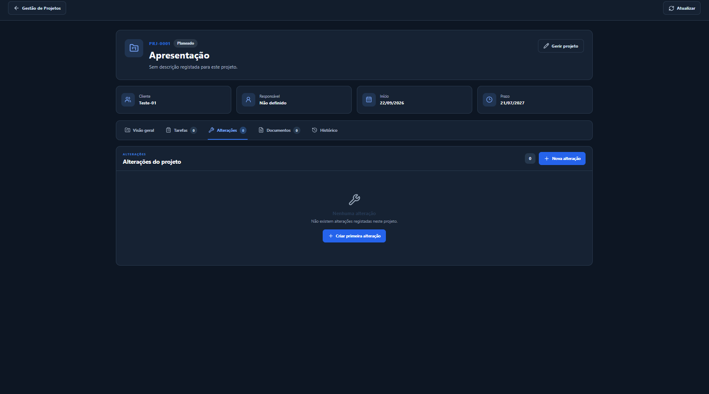
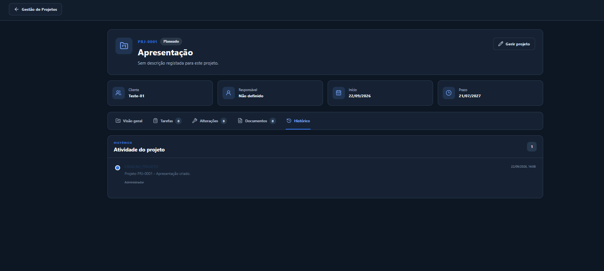

# Plataforma de Gestão de Projetos

Aplicação web Full-Stack desenvolvida para centralizar e organizar a gestão de clientes, projetos, tarefas, alterações, documentos e utilizadores.

Desenvolvido por **Daniel Carvalho** utilizando **React, TypeScript, ASP.NET Core, Entity Framework Core e SQL Server**.

---

## Visão Geral



A Plataforma de Gestão de Projetos foi desenvolvida para centralizar informações que normalmente se encontram distribuídas entre documentos, pastas, folhas de cálculo e diferentes meios de comunicação.

A aplicação permite acompanhar o ciclo de um projeto através de uma interface centralizada, desde o registo do cliente e criação do projeto até à gestão de tarefas, alterações, documentos e histórico de atividades.

O sistema utiliza uma arquitetura separada entre **Frontend, Backend e Base de Dados**, com comunicação através de uma API REST.

---

## Tecnologias

### Backend

- C#
- ASP.NET Core
- .NET 10
- Entity Framework Core
- REST API
- JWT Authentication

### Frontend

- React
- TypeScript
- Vite
- React Router
- Lucide React
- CSS

### Base de Dados

- Microsoft SQL Server
- Entity Framework Core Database First

### Ferramentas

- Visual Studio 2022
- SQL Server Management Studio
- Git
- GitHub
- PowerShell

---

## Principais Funcionalidades

- Autenticação através de JWT
- Controlo de acesso por perfil
- Dashboard com indicadores
- Gestão de clientes
- Gestão de projetos
- Gestão de tarefas
- Definição de prioridades e estados
- Registo de alterações dos projetos
- Upload e gestão de documentos
- Download e visualização protegida de ficheiros
- Histórico de atividades
- Sistema de notificações
- Gestão de utilizadores
- Perfil do utilizador
- Alteração de palavra-passe
- Tema claro e escuro
- Menu lateral minimizável
- Interface responsiva

---

## Interface da Aplicação

### Login



### Dashboard


### Gestão de Projetos



### Detalhe do Projeto



### Documentos e Alterações



### Histórico



---

## Arquitetura

A aplicação está dividida em três componentes principais:

```text
Frontend
   |
   | HTTP / REST
   |
   v
ASP.NET Core API
   |
   | Entity Framework Core
   |
   v
SQL Server
```

O **Frontend React** é responsável pela interface e interação com o utilizador.

O **Backend ASP.NET Core** disponibiliza a API REST e concentra a lógica da aplicação, autenticação, autorização, validações e operações sobre os dados.

O **Entity Framework Core** realiza a comunicação entre a API e a base de dados SQL Server.

---

## Estrutura do Projeto

```text
Plataforma-Gestao-Projetos/
|
|-- backend/
|   `-- GestaoProjetos/
|
|-- frontend/
|   `-- GestaoProjetosWeb/
|
|-- database/
|   `-- GestaoProjetosDB.sql
|
|-- screenshots/
|
|-- .gitignore
|
`-- README.md
```

---

## Backend e API

O backend foi desenvolvido em **ASP.NET Core** seguindo uma estrutura baseada em Controllers, Models e DTOs.

A API disponibiliza endpoints para os principais módulos da aplicação:

```text
/api/Auth
/api/Clientes
/api/Projetos
/api/Tarefas
/api/Alteracoes
/api/Documentos
/api/Historicos
/api/Utilizadores
/api/Notificacoes
```

As operações protegidas exigem autenticação através de JWT.

---

## Autenticação e Segurança

A aplicação utiliza **JSON Web Tokens (JWT)** para autenticação.

Após um login válido, a API gera um token utilizado pelo frontend para realizar pedidos aos endpoints protegidos.

O sistema trabalha com diferentes perfis de acesso:

- Administrador
- Gestor
- Colaborador

As permissões disponíveis dependem do perfil do utilizador autenticado.

Os documentos armazenados pela aplicação são disponibilizados através de endpoints protegidos da API, evitando exposição direta dos ficheiros.

Credenciais privadas, uploads reais e chaves JWT de produção não fazem parte deste repositório público.

---

## Base de Dados

A aplicação utiliza uma base de dados relacional em **Microsoft SQL Server**.

Entre as principais entidades encontram-se:

```text
Cliente
Projeto
Tarefa
Alteracao
Documento
Historico
Utilizador
```

A estrutura inclui relacionamentos, chaves estrangeiras, índices e regras de integridade.

O script para criação da base de dados encontra-se em:

```text
database/GestaoProjetosDB.sql
```

---

## Como Executar

### Requisitos

Para executar o projeto localmente são necessários:

- .NET 10 SDK
- Node.js
- npm
- Microsoft SQL Server
- Git

### 1. Clonar o repositório

```bash
git clone URL_DO_REPOSITORIO
```

Entre na pasta:

```bash
cd Plataforma-Gestao-Projetos
```

### 2. Criar a base de dados

Abra o ficheiro:

```text
database/GestaoProjetosDB.sql
```

no SQL Server Management Studio e execute o script.

### 3. Configurar o Backend

Configure a ligação à base de dados no ficheiro:

```text
backend/GestaoProjetos/appsettings.json
```

Exemplo de configuração local:

```json
{
  "ConnectionStrings": {
    "DefaultConnection": "Server=.\\SQLEXPRESS;Database=GestaoProjetosDB;Trusted_Connection=True;TrustServerCertificate=True;"
  },
  "Jwt": {
    "Key": "CONFIGURE_UMA_CHAVE_JWT_LOCAL_SEGURA_COM_32_OU_MAIS_CARACTERES",
    "Issuer": "GestaoProjetosApi",
    "Audience": "GestaoProjetosFrontend",
    "ExpireMinutes": 120
  }
}
```

Ajuste o nome do servidor SQL de acordo com o ambiente local.

### 4. Executar o Backend

```bash
cd backend/GestaoProjetos
dotnet restore
dotnet build
dotnet run
```

Durante o desenvolvimento, a API pode ser executada em:

```text
http://localhost:5118
```

### 5. Executar o Frontend

Abra outro terminal e execute:

```bash
cd frontend/GestaoProjetosWeb
npm install
npm run dev
```

O frontend ficará normalmente disponível em:

```text
http://localhost:5173
```

Durante o desenvolvimento, o Vite utiliza proxy para encaminhar os pedidos `/api` para o backend.

---

## Organização dos Projetos

A aplicação permite organizar os dados através de uma estrutura centralizada:

```text
Cliente
   |
   `-- Projeto
         |
         |-- Tarefas
         |-- Alterações
         |-- Documentos
         `-- Histórico
```

Desta forma, as informações relacionadas com cada projeto permanecem agrupadas e podem ser consultadas através de uma única interface.

---

## Validação

Durante o desenvolvimento foram realizados testes relacionados com:

- criação da base de dados;
- compilação do backend;
- compilação do frontend;
- comunicação entre frontend e API;
- autenticação JWT;
- autorização por perfil;
- operações CRUD;
- gestão de documentos;
- histórico de atividades;
- notificações;
- execução da aplicação em ambiente local.

---

## Competências Demonstradas

Este projeto demonstra conhecimentos práticos em desenvolvimento **Full-Stack**, incluindo:

**Frontend**
- React
- TypeScript
- Componentização
- Gestão de estado
- Consumo de APIs REST
- Routing
- Desenvolvimento de interfaces

**Backend**
- C#
- ASP.NET Core
- REST APIs
- Autenticação JWT
- Autorização por perfil
- Validação de dados
- Upload e gestão de ficheiros

**Base de Dados**
- SQL Server
- Modelação relacional
- Entity Framework Core
- Database First
- Relacionamentos e integridade de dados

**Engenharia de Software**
- Arquitetura Full-Stack
- Separação de responsabilidades
- Git e controlo de versões
- Segurança de aplicações web
- Integração entre frontend, backend e base de dados

---

## Autor

**Daniel Carvalho**

Full-Stack Developer

Projeto desenvolvido em 2026 como demonstração prática da construção de uma aplicação web completa, integrando frontend, API REST, autenticação, autorização e base de dados relacional.